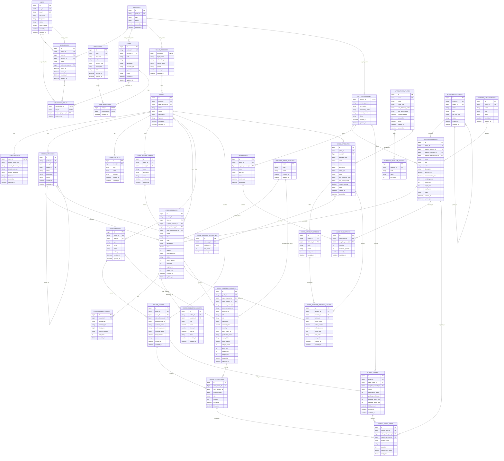

```mermaid
erDiagram

    USERS ||--o{ MEMBERSHIPS : has
    ACCOUNTS ||--o{ MEMBERSHIPS : contains

    MEMBERSHIPS ||--o{ MEMBERSHIP_ROLES : has
    ROLES ||--o{ MEMBERSHIP_ROLES : assigned_as

    ROLES ||--o{ ROLE_PERMISSIONS : has
    PERMISSIONS ||--o{ ROLE_PERMISSIONS : grants

    ACCOUNTS ||--o{ ROLES : owns_custom_roles
    USERS ||--o{ MEMBERSHIP_ROLES : assigned_roles
    USERS ||--o{ MEMBERSHIPS : invited_users

    ACCOUNTS ||--o| SELLER_ACCOUNTS : seller_profile
    ACCOUNTS ||--o| SUPPLIER_ACCOUNTS : supplier_profile


    SELLER_ACCOUNTS ||--o{ STORES : owns

    STORES ||--|| STORE_SETTINGS : has

    STORES ||--o{ STORE_CATEGORIES : has
    STORES ||--o{ STORE_CONTACTS : has
    STORES ||--o{ STORE_MANUFACTURERS : has
    STORES ||--o{ STORE_PRODUCTS : has
    STORES ||--o{ SALES_CHANNELS : has
    STORES ||--o{ SELLER_ORDERS : receives

    STORE_CATEGORIES ||--o{ STORE_PRODUCTS : classifies
    STORE_CATEGORIES ||--o{ STORE_CATEGORIES : parent_of
    STORE_MANUFACTURERS ||--o{ STORE_PRODUCTS : brands
    STORE_PRODUCTS ||--o{ STORE_PRODUCT_IMAGES : has
    STORE_PRODUCTS ||--o{ STORE_PRODUCT_DISCOUNTS : discounted_by

    ATTRIBUTE_TEMPLATES ||--o{ ATTRIBUTE_TEMPLATE_OPTIONS : offers
    ATTRIBUTE_TEMPLATES ||--o{ STORE_ATTRIBUTES : adopted_as
    STORES ||--o{ STORE_ATTRIBUTES : owns
    STORE_ATTRIBUTES ||--o{ STORE_ATTRIBUTE_OPTIONS : offers
    STORE_CATEGORIES ||--o{ STORE_CATEGORY_ATTRIBUTES : offers
    STORE_ATTRIBUTES ||--o{ STORE_CATEGORY_ATTRIBUTES : bound_to
    STORE_PRODUCTS ||--o{ STORE_PRODUCT_ATTRIBUTE_VALUES : described_by
    STORE_ATTRIBUTES ||--o{ STORE_PRODUCT_ATTRIBUTE_VALUES : defines
    STORE_ATTRIBUTE_OPTIONS ||--o{ STORE_PRODUCT_ATTRIBUTE_VALUES : chosen_as

    SUPPLIER_ACCOUNTS ||--o{ SUPPLIER_PRODUCTS : owns
    SUPPLIER_ACCOUNTS ||--o{ WAREHOUSES : has
    SUPPLIER_ACCOUNTS ||--o{ SUPPLY_ORDERS : receives

    PLATFORM_CATEGORIES ||--o{ SUPPLIER_PRODUCTS : classifies
    PLATFORM_CATEGORIES ||--o{ PLATFORM_CATEGORIES : parent_of
    PLATFORM_MANUFACTURERS ||--o{ SUPPLIER_PRODUCTS : brands

    PLATFORM_STOCK_STATUSES ||--o{ STORE_PRODUCTS : stock_status
    PLATFORM_STOCK_STATUSES ||--o{ SALES_CHANNEL_PRODUCTS : channel_stock_status

    SUPPLIER_PRODUCTS ||--o{ STORE_PRODUCTS : source_for

    WAREHOUSES ||--o{ WAREHOUSE_STOCKS : contains
    SUPPLIER_PRODUCTS ||--o{ WAREHOUSE_STOCKS : stocked_as

    SALES_CHANNELS ||--o{ SELLER_ORDERS : source
    SALES_CHANNELS ||--o{ SALES_CHANNEL_PRODUCTS : sale_channel
    STORE_PRODUCTS ||--o{ SALES_CHANNEL_PRODUCTS : product

    SELLER_ORDERS ||--o{ SELLER_ORDER_ITEMS : contains
    SALES_CHANNEL_PRODUCTS ||--o{ SELLER_ORDER_ITEMS : sold_as

    SELLER_ORDERS ||--o{ SUPPLY_ORDERS : split_into
    SUPPLY_ORDERS ||--o{ SUPPLY_ORDER_ITEMS : contains
    SUPPLIER_PRODUCTS ||--o{ SUPPLY_ORDER_ITEMS : supplied_as
    SELLER_ORDER_ITEMS ||--o{ SUPPLY_ORDER_ITEMS : fulfilled_by


    USERS {
        bigint id PK
        UUID ext_id UK
        string email UK
        string first_name
        string last_name
        string status
        boolean email_verified
        datetime created_at
        datetime updated_at
    }

    ACCOUNTS {
        bigint id PK
        string public_id UK
        string type
        string status
        datetime created_at
        datetime updated_at
    }

    MEMBERSHIPS {
        bigint id PK
        string public_id UK
        bigint user_id FK
        bigint account_id FK
        string status
        bigint invited_by_user_id FK
        datetime invited_at
        datetime joined_at
        datetime created_at
        datetime updated_at
    }

    ROLES {
        bigint id PK
        string public_id UK
        bigint account_id FK
        string code
        string name
        string description
        string account_type
        boolean is_system
        string status
        datetime created_at
        datetime updated_at
    }

    MEMBERSHIP_ROLES {
        bigint membership_id PK, FK
        bigint role_id PK, FK
        bigint assigned_by_user_id FK
        datetime assigned_at
    }

    PERMISSIONS {
        bigint id PK
        string code UK
        string resource
        string action
        string account_type
        string description
        string status
        datetime created_at
        datetime updated_at
    }

    ROLE_PERMISSIONS {
        bigint role_id PK, FK
        bigint permission_id PK, FK
        datetime created_at
    }

    SELLER_ACCOUNTS {
        bigint account_id PK, FK
        string legal_name
        string onboarding_status
        string contact_email
        string phone
        datetime created_at
        datetime updated_at
    }

    SUPPLIER_ACCOUNTS {
        bigint account_id PK, FK
        string company_name
        string tax_number
        string onboarding_status
        string contact_email
        string phone
        datetime created_at
        datetime updated_at
    }

    STORES {
        bigint id PK
        string public_id UK
        bigint seller_account_id FK
        string name
        string status
        string description
        string logo_url
        datetime created_at
        datetime updated_at
    }

    STORE_SETTINGS {
        bigint store_id PK, FK
        string default_weight_unit
        string default_dimension_unit
        string default_currency
        string default_language
        string timezone
        datetime created_at
        datetime updated_at
    }

    STORE_CONTACTS {
        bigint id PK
        bigint store_id FK
        string type 
        string value
        string comment
        datetime created_at
        datetime updated_at
    }

    STORE_CATEGORIES {
        bigint id PK
        string public_id UK
        bigint store_id FK
        bigint parent_id FK
        string name
        string description
        string status
        datetime created_at
        datetime updated_at
    }

    STORE_MANUFACTURERS {
        bigint id PK
        string public_id UK
        bigint store_id FK
        string name
        string description
        string status
        datetime created_at
        datetime updated_at
    }

    PLATFORM_STOCK_STATUSES {
        id bigint PK
        string code
        string name
        datetime created_at 
        datetime updated_at
    }

    STORE_PRODUCTS {
        bigint id PK
        string public_id UK
        bigint store_id FK
        bigint supplier_product_id FK
        bigint store_category_id FK
        bigint store_manufacturer_id FK
        string name
        string sku
        string code
        string description
        decimal price
        int quantity
        bigint stock_status_id
        string status
        int weight_grams
        int width_mm
        int height_mm
        int length_mm
        datetime created_at
        datetime updated_at
    }

    STORE_PRODUCT_IMAGES {
        bigint id PK
        bigint product_id FK
        string storage_key
        string content_type
        bigint size_bytes
        string original_filename
        int sort_order
        datetime created_at
    }

    STORE_PRODUCT_DISCOUNTS {
        bigint id PK
        string public_id UK
        bigint product_id FK
        string type
        decimal value
        datetime starts_at
        datetime ends_at
        string label
        datetime created_at
        datetime updated_at
    }

    ATTRIBUTE_TEMPLATES {
        bigint id PK
        string code UK
        string name
        string value_type
        string unit_dictionary_code
        string unit_default_code
        boolean variant_defining
        int sort_order
        boolean active
        datetime created_at
        datetime updated_at
    }

    ATTRIBUTE_TEMPLATE_OPTIONS {
        bigint id PK
        bigint template_id FK
        string code
        string name
        int sort_order
    }

    STORE_ATTRIBUTES {
        bigint id PK
        string public_id UK
        bigint store_id FK
        string template_code
        string code
        string name
        string description
        string value_type
        string scope
        string unit_dictionary_code
        string unit_default_code
        boolean variant_defining
        string status
        datetime created_at
        datetime updated_at
    }

    STORE_ATTRIBUTE_OPTIONS {
        bigint id PK
        string public_id UK
        bigint attribute_id FK
        string code
        string name
        int sort_order
        datetime created_at
    }

    STORE_CATEGORY_ATTRIBUTES {
        bigint id PK
        bigint category_id FK
        bigint attribute_id FK
        int sort_order
        datetime created_at
    }

    STORE_PRODUCT_ATTRIBUTE_VALUES {
        bigint id PK
        bigint product_id FK
        bigint attribute_id FK
        bigint option_id FK
        string value_string
        decimal value_number
        boolean value_boolean
        date value_date
        string unit_code
        int sort_order
        datetime created_at
        datetime updated_at
    }

    SUPPLIER_PRODUCTS {
        bigint id PK
        string public_id UK
        bigint supplier_account_id FK
        bigint platform_category_id FK
        bigint platform_manufacturer_id FK
        string name
        string sku
        string code
        string description
        decimal partner_price
        decimal recommended_price
        int weight_grams
        int width_mm
        int height_mm
        int length_mm
        string status
        datetime created_at
        datetime updated_at
    }

    PLATFORM_CATEGORIES {
        bigint id PK
        string public_id UK
        bigint parent_id FK
        string name
        string slug
        string full_slug_path
        string status
        datetime created_at
        datetime updated_at
    }

    PLATFORM_MANUFACTURERS {
        bigint id PK
        string public_id UK
        string name
        string slug
        string status
        datetime created_at
        datetime updated_at
    }

    WAREHOUSES {
        bigint id PK
        string public_id UK
        bigint supplier_account_id FK
        string name
        string address
        string status
        datetime created_at
        datetime updated_at
    }

    WAREHOUSE_STOCKS {
        bigint id PK
        bigint warehouse_id FK
        bigint supplier_product_id FK
        int quantity
        int reserved_quantity
        datetime created_at
        datetime updated_at
    }

    SALES_CHANNELS {
        bigint id PK
        string public_id UK
        bigint store_id FK
        string type
        string name
        string status
        json settings
        datetime created_at
        datetime updated_at
    }

    SALES_CHANNEL_PRODUCTS {
        bigint id PK
        string public_id UK
        bigint sales_channel_id FK
        bigint store_product_id FK
        string external_product_id
        string external_variant_id
        string external_url
        string title
        string sku
        string description
        decimal channel_price
        int quantity
        bigint stock_status_id
        string publication_status
        string sync_status
        boolean sync_enabled
        int weight_grams
        int width_mm
        int height_mm
        int length_mm
        datetime created_at
        datetime updated_at
    }

    SELLER_ORDERS {
        bigint id PK
        string public_id UK
        bigint store_id FK
        bigint sales_channel_id FK
        string external_order_id
        string customer_name
        string customer_phone
        string customer_email
        decimal total_amount
        string status
        datetime created_at
        datetime updated_at
    }

    SELLER_ORDER_ITEMS {
        bigint id PK
        bigint seller_order_id FK
        bigint store_product_id FK
        string product_name
        string sku
        int quantity
        decimal unit_price
        decimal total_price
    }

    SUPPLY_ORDERS {
        bigint id PK
        string public_id UK
        bigint seller_order_id FK
        bigint supplier_account_id FK
        string status
        int total_weight_grams
        int package_width_mm
        int package_height_mm
        int package_length_mm
        decimal total_amount
        datetime created_at
        datetime updated_at
    }

    SUPPLY_ORDER_ITEMS {
        bigint id PK
        bigint supply_order_id FK
        bigint seller_order_item_id FK
        bigint supplier_product_id FK
        string product_name
        string sku
        int quantity
        decimal supplier_unit_price
        decimal total_price
    }
```