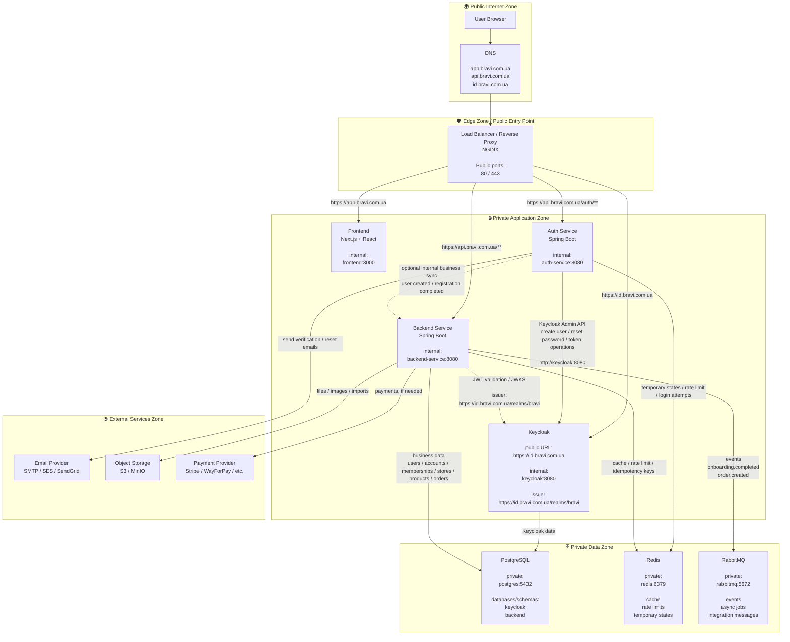

```mermaid
flowchart TD

    %% =========================
    %% PUBLIC ZONE
    %% =========================

    subgraph PUBLIC["🌍 Public Internet Zone"]
        USER["User Browser"]
        DNS["DNS<br/><br/>app.bravi.com.ua<br/>api.bravi.com.ua<br/>id.bravi.com.ua"]
    end

    USER --> DNS

    %% =========================
    %% EDGE ZONE
    %% =========================

    subgraph EDGE["🛡️ Edge Zone / Public Entry Point"]
        LB["Load Balancer / Reverse Proxy<br/>NGINX<br/><br/>Public ports:<br/>80 / 443"]
    end

    DNS --> LB

    %% =========================
    %% APPLICATION ZONE
    %% =========================

    subgraph APP["🔒 Private Application Zone"]
        FE["Frontend<br/>Next.js + React<br/><br/>internal:<br/>frontend:3000"]

        AUTH["Auth Service<br/>Spring Boot<br/><br/>internal:<br/>auth-service:8080"]

        BACK["Backend Service<br/>Spring Boot<br/><br/>internal:<br/>backend-service:8080"]

        KC["Keycloak<br/><br/>public URL:<br/>https://id.bravi.com.ua<br/><br/>internal:<br/>keycloak:8080<br/><br/>issuer:<br/>https://id.bravi.com.ua/realms/bravi"]
    end

    LB -->|"https://app.bravi.com.ua"| FE

    LB -->|"https://api.bravi.com.ua/auth/**"| AUTH

    LB -->|"https://api.bravi.com.ua/**"| BACK

    LB -->|"https://id.bravi.com.ua"| KC

    %% =========================
    %% INTERNAL SERVICE COMMUNICATION
    %% =========================

    AUTH -->|"Keycloak Admin API<br/>create user / reset password / token operations<br/><br/>http://keycloak:8080"| KC

    BACK -.->|"JWT validation / JWKS<br/><br/>issuer:<br/>https://id.bravi.com.ua/realms/bravi"| KC

    AUTH -.->|"optional internal business sync<br/>user created / registration completed"| BACK

    %% =========================
    %% DATA ZONE
    %% =========================

    subgraph DATA["🗄️ Private Data Zone"]
        PG["PostgreSQL<br/><br/>private:<br/>postgres:5432<br/><br/>databases/schemas:<br/>keycloak<br/>backend"]

        REDIS["Redis<br/><br/>private:<br/>redis:6379<br/><br/>cache<br/>rate limits<br/>temporary states"]

        MQ["RabbitMQ<br/><br/>private:<br/>rabbitmq:5672<br/><br/>events<br/>async jobs<br/>integration messages"]
    end

    KC -->|"Keycloak data"| PG

    BACK -->|"business data<br/>users / accounts / memberships / stores / products / orders"| PG

    AUTH -->|"temporary states / rate limit / login attempts"| REDIS

    BACK -->|"cache / rate limit / idempotency keys"| REDIS

    BACK -->|"events<br/>onboarding.completed<br/>order.created"| MQ

    %% =========================
    %% EXTERNAL ZONE
    %% =========================

    subgraph EXT["🌐 External Services Zone"]
        EMAIL["Email Provider<br/>SMTP / SES / SendGrid"]
        STORAGE["Object Storage<br/>S3 / MinIO"]
        PAYMENT["Payment Provider<br/>Stripe / WayForPay / etc."]
    end

    AUTH -->|"send verification / reset emails"| EMAIL

    BACK -->|"files / images / imports"| STORAGE

    BACK -->|"payments, if needed"| PAYMENT
```